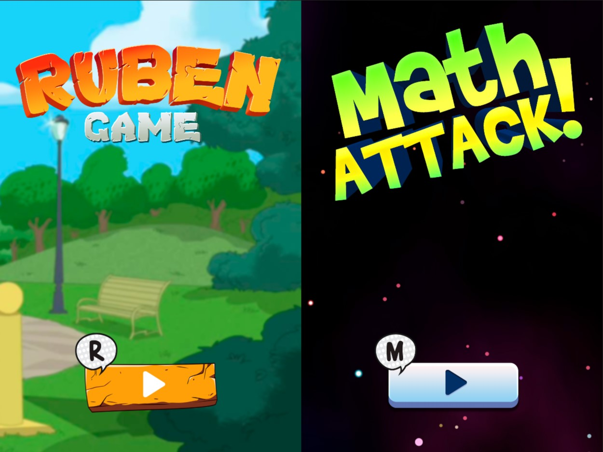
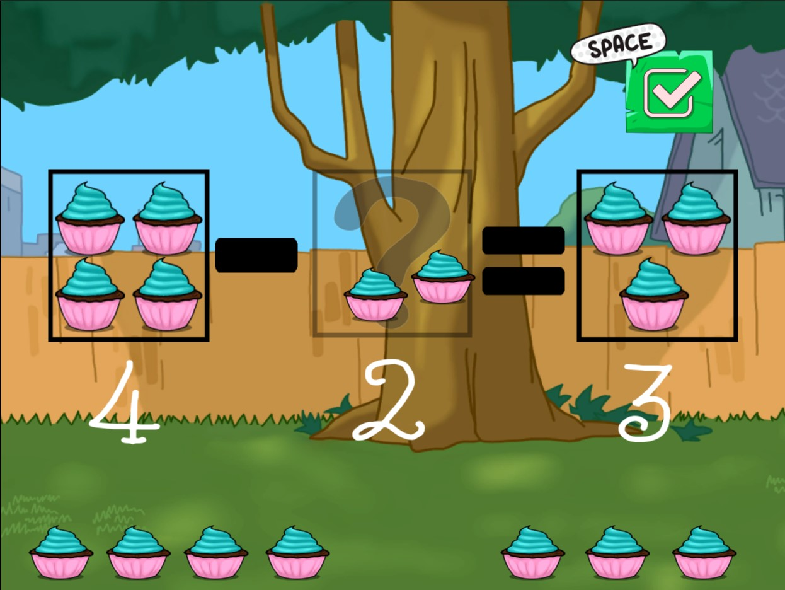
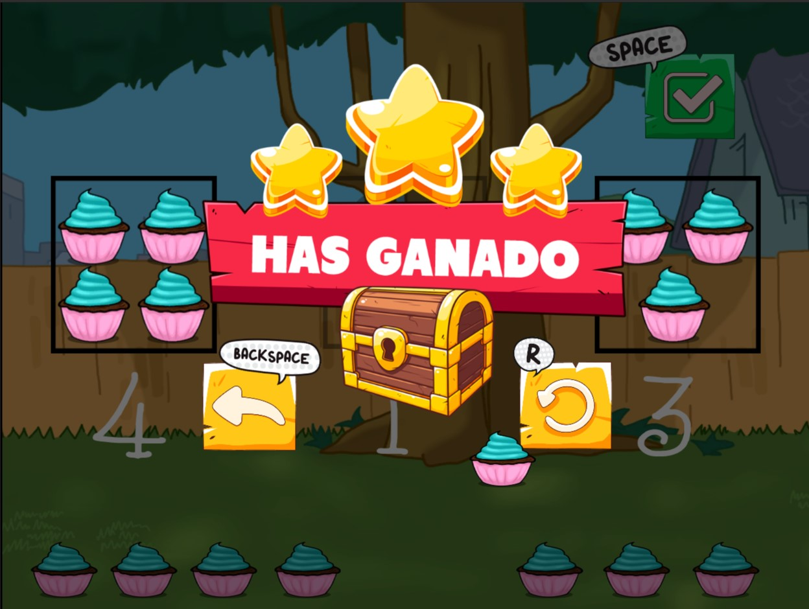
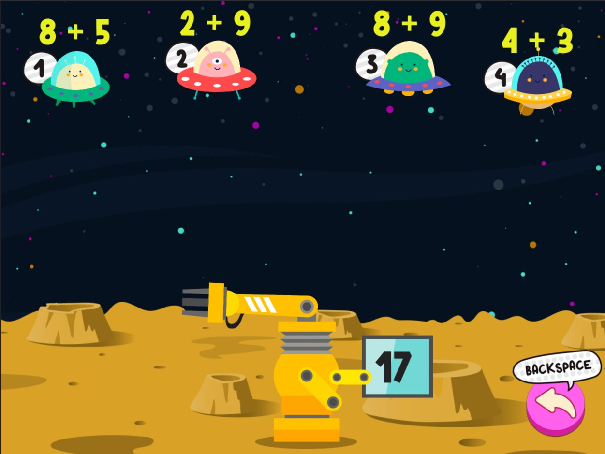
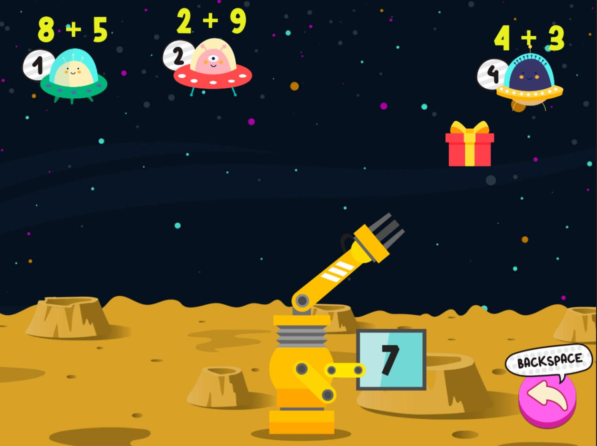

Project made for the third year of **Multimedia engineering**.

This project is basically two videogames made with ***Unity*** and focused about make them the most accesible and usable for kids between 4 and 8 years old. 

Here are some pics of the games

# Videogame 1 (Ruben Game)

Menu            |  Game
:-------------------------:|:-------------------------:
  |  

    

---

# Videogame 2 (Math Attack!)

Menu            |  Game
:-------------------------:|:-------------------------:
  |  

